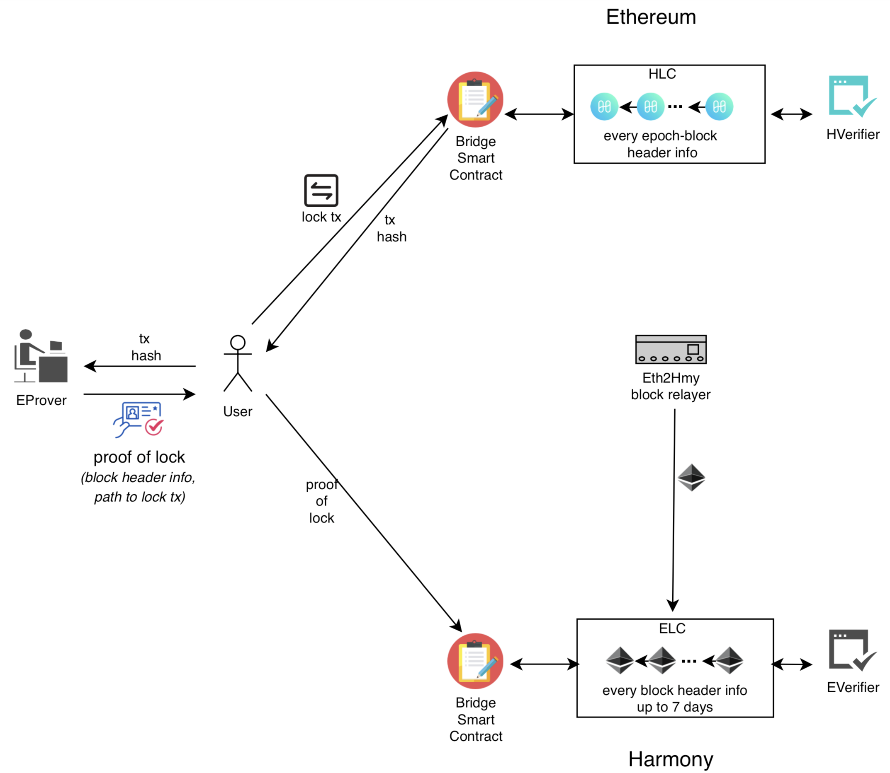
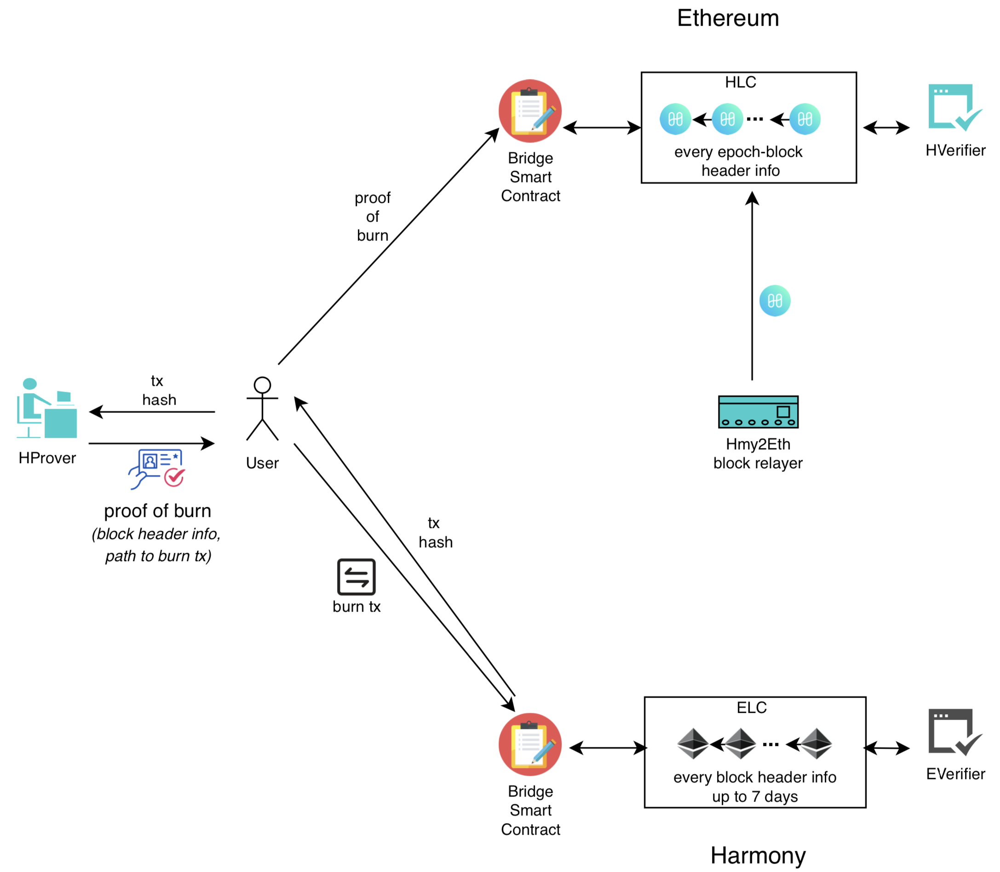

# AstraAstraLink

AstraAstraLink - a trustless astra to ethereum bridge

## Key points

- A bridge with cross-chain light clients, relayers, and prover full nodes, all trustless, no additional trust assumptions beyond the two blockchains that the bridge is connected to.
- A gas-efficient Astra light client on Ethereum (could be generalized to other chains) that only requires checkpoint blocks (1 block every x blocks, where 1 ≤ x ≤ 16384, 16384 is the #blocks per epoch) to verify any number of Astra transaction proofs by the clients.
- A constant-size Astra light client proof that any user needs to send cross-chain (e.g., Ethereum) to claim their Astra transaction.

## Bridge Components

### Used in Ethereum to Astra flow

- Bridge smart contract on Astra
- Ethereum Light Client (ELC) smart contract on Astra
- Ethereum Verifier (EVerifier) smart contract on Astra
- Ethereum Prover (EProver) is an Ethereum full node or a client that has access to a full node
- Ethereum Relayer relays every Ethereum header information to ELC

### Used in Astra to Ethereum flow

- Bridge smart contract on Ethereum
- Astra Light Client (HLC) smart contract on Ethereum
- Astra Verifier (HVerifier) smart contract on Ethereum
- Astra Prover (HProver) is a Astra full node or a client that has access to a full node
- Astra Relayer relays every checkpoint block header information to HLC

## Ethereum to Astra asset transfer

1. User locks ERC20 on Ethereum by transferring to bridge smart contract and obtains the hash of this transaction from blockchain
2. User sends the hash to EProver and receives proof-of-lock
3. User sends the proof-of-lock to bridge smart contract on Astra
4. Bridge smart contract on Astra invokes ELC and EVerifier to verify the proof-of-lock and mints ERC20 (equivalent amount)

## Astra to Ethereum asset redeem

1. User burns ERC20 on Astra using Bridge smart contract and obtains the hash of this transaction from blockchain
2. User sends the hash to HProver and receives proof-of-burn
3. User sends the proof-of-burn to bridge smart contract on Ethereum
4. Bridge smart contract on Ethereum invokes HLC and HVerifier to verify the proof-of-burn and unlocks ERC20 (equivalent amount)

## Order of deployment

1. node cli/index.js Bridge deploy <ETH_RPC> <ASTRA_RPC>
2. node cli/index.js ELC deploy <ASTRA_RPC> --url <ETH_RPC> --block <block>
3. node cli/index.js ethRelay relay <ETH_RPC> <ASTRA_RPC> <ELC_ADDRESS>
